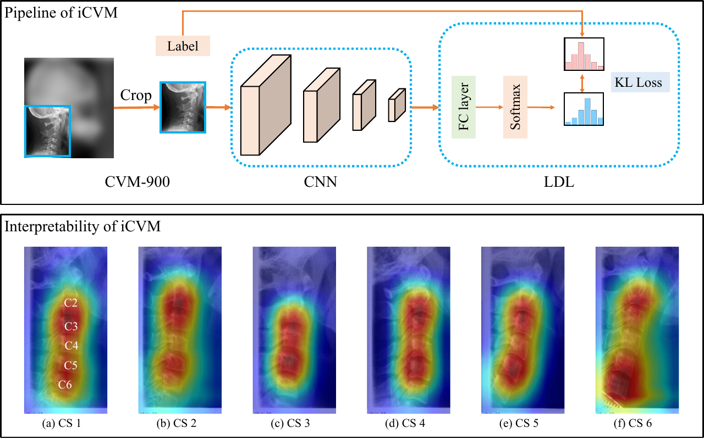

---
title: "iCVM: An Interpretable Deep Learning Model for CVM Assessment under Label Uncertainty"
author: "Ni Liao<sup>1</sup>, Jian Dai<sup>1</sup>, Yao Tang, Qiaoyong Zhong<sup>*</sup> and Shuixue Mo"
date: 2022-05-30
header-includes: |
  <style>
  h1 {
    font-size: 1.5em;
  }
  </style>
...

## Abstract

The Cervical Vertebral Maturation (CVM) method aims to determine the craniofacial skeletal maturational stage, which is crucial for orthodontic and orthopedic treatment. In this paper, we explore the potential of deep learning for automatic CVM assessment. In particular, we propose a convolutional neural network named iCVM. Based on the residual network, it is specialized for the challenges unique to the task of CVM assessment. 1) To combat overfitting due to limited data size, multiple dropout layers are utilized. 2) To address the inevitable label ambiguity between adjacent maturational stages, we introduce the concept of label distribution learning in the loss function. Besides, we attempt to analyze the regions important for the prediction of the model by using the Grad-CAM technique. The learned strategy shows surprisingly high consistency with the clinical criteria. This indicates that the decisions made by our model are well interpretable, which is critical in evaluation of growth and development in orthodontics. Moreover, to drive future research in the field, we release a new dataset named CVM-900 along with the paper. It contains the cervical part of 900 lateral cephalograms collected from orthodontic patients of different ages and genders. Experimental results show that the proposed approach achieves superior performance on CVM-900 in terms of various evaluation metrics.

## Paper



Download paper

- arXiv version
- J-BHI version

## CVM-900 Dataset

To apply for the CVM-900 dataset introduced in the paper, please fill the following form and send it to [Qiaoyong Zhong](mailto:zhongqiaoyong@hikvision.com). We will review the application within a week. If the application passes, the download link of the dataset will be sent by email.

> Subject: Application for the CVM-900 Dataset
>
> Name: {name of the applicant}
>
> Affiliation: {affiliation and position of the applicant}
>
> Purpose: {usage of the dataset, e.g. acadamic research or commercial use}

## Citation

```BibTeX
@article{liao2022icvm,
  title={iCVM: An Interpretable Deep Learning Model for CVM Assessment under Label Uncertainty},
  author={Liao, Ni and Dai, Jian and Tang, Yao and Zhong, Qiaoyong and Mo, Shuixue},
  journal={IEEE Journal of Biomedical and Health Informatics},
  year={2022},
  volume={},
  number={},
  pages={},
  doi={10.1109/JBHI.2022.3179619}
}
```